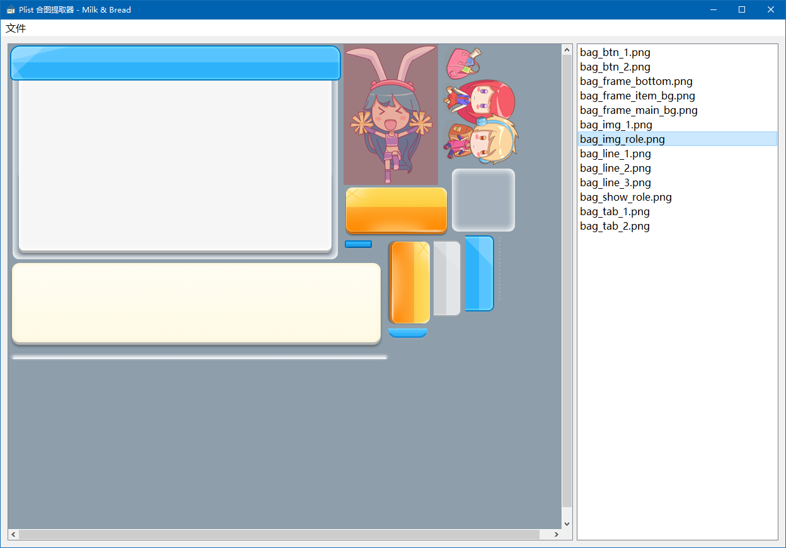
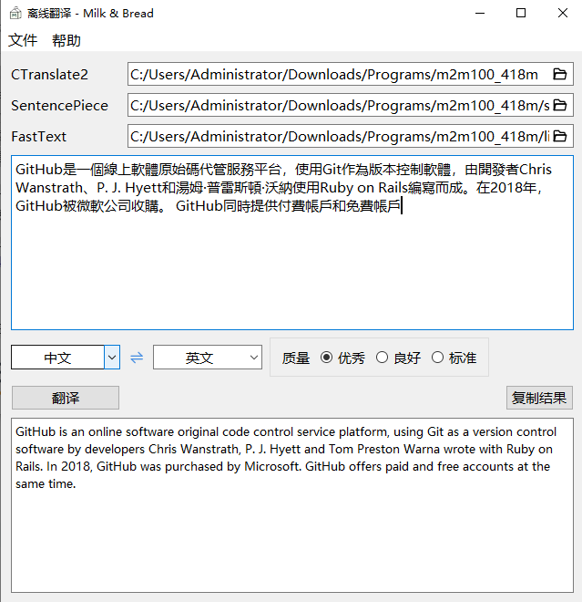
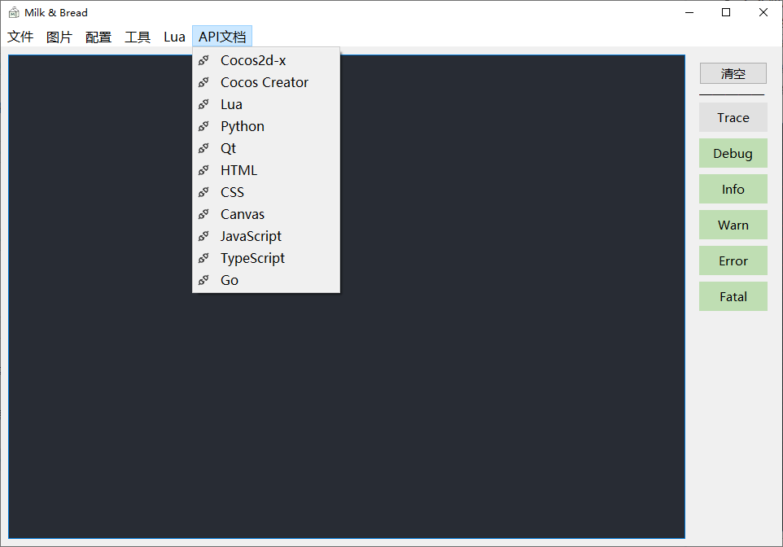
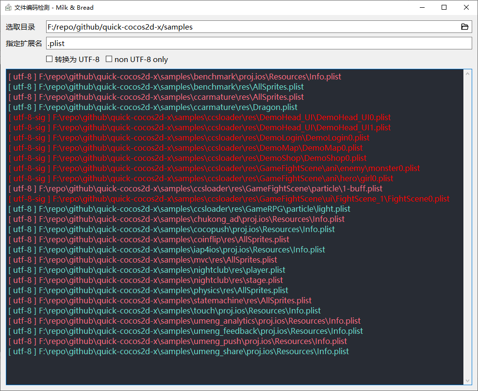

# 🥛 Milk & Bread 🍞

## Preface

> 持续更新中...

## TODO

- ❌ Random reward for private use
- ❌ Simple TODOs
- ❌ Something about Lua
- ❌ Something about Cocos2d-x / Cocos Creator
- ❌ Offline API Docs
- ❌ Excel to Lua / Json / Xml 
- ❌ 密码管理器

## Done

- ✔ 随机壁纸
  
    
  
- ✔ Spine Atlas 提取器
  
    
  
- ✔ Plist 合图提取器

    

- ✔ 离线翻译
  
    

- ✔ 在线文档

  

- ✔ 文件编码检测与转换工具

  

- ✔ Lua 语法检测工具

  
